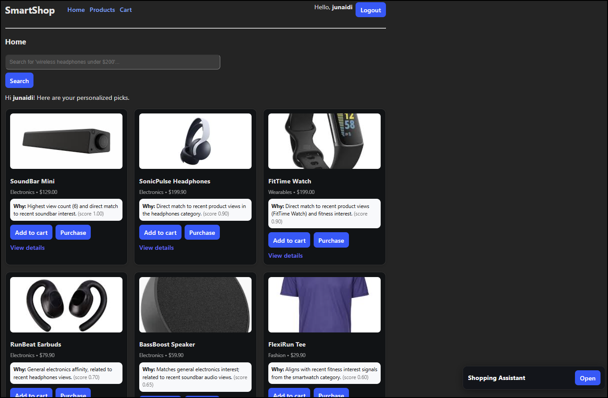
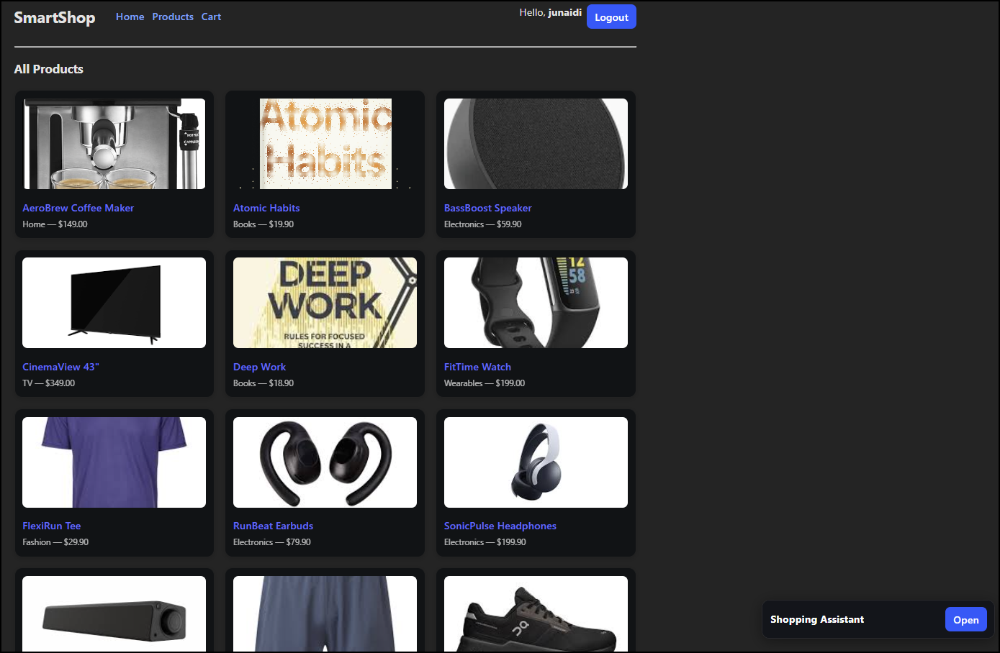
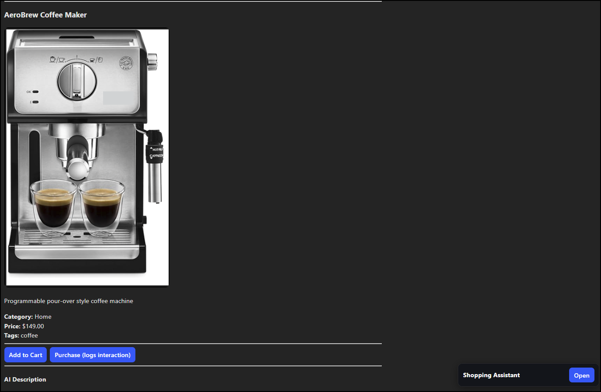
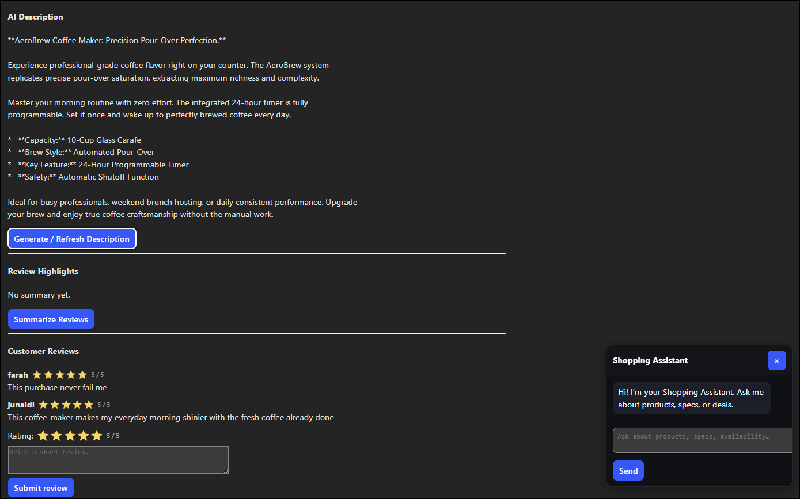
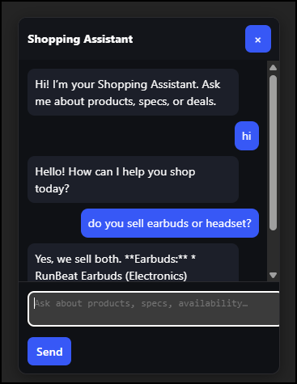
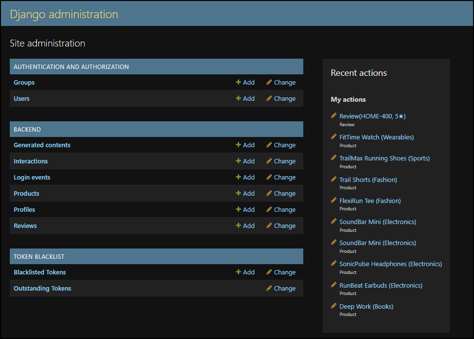

# SmartShop — AI E-commerce (Django + React + Gemini)

Personalized product recommendations, smart search, chatbot, reviews, cart & checkout.

## Tech Stack
- **Backend**: Django REST Framework, MySQL/SQLite, JWT (simplejwt)
- **AI**: Google Gemini (descriptions, chatbot, rerank), classic heuristics (candidates)
- **Frontend**: React + Vite
- **Testing**: pytest, DRF APITestCase, Locust, Lighthouse (UI perf)
- **Security**: JWT auth, HTTPS, DRF permissions, throttling, .env secrets

## Screenshots







## Running locally

### Backend
```bash
cd backend
cp .env.example .env   # fill values
python -m venv venv && source venv/bin/activate  # Windows: venv\Scripts\activate
pip install -r requirements.txt
python manage.py migrate
python manage.py runserver
